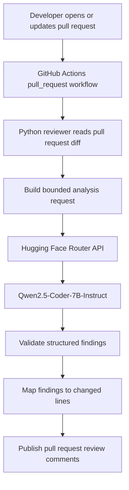

# DevSecOps-AI: Model Details & Implementation Architecture

This document describes the model and GitHub Actions integration used by the DevSecOps-AI pull request reviewer. The workflow and Python reviewer are implemented in this repository. The security and validation notes below distinguish current behavior from recommended hardening.

## Table of contents

- [Model information and specifications](#model-information-and-specifications)
- [Model evaluation and rationale](#model-evaluation-and-rationale)
- [Architecture and integration workflow](#architecture-and-integration-workflow)
- [How the setup works](#how-the-setup-works)
  - [1. Token authentication and API access](#1-token-authentication-and-api-access)
  - [2. Prompt injection defenses and payload formatting](#2-prompt-injection-defenses-and-payload-formatting)
  - [3. Response parsing and GitHub integration](#3-response-parsing-and-github-integration)
- [Performance and security considerations](#performance-and-security-considerations)

## Model information and specifications

The reviewer uses **Qwen2.5-Coder-7B-Instruct**, an open-weight code model from Alibaba's Qwen team.

| Attribute | Specification |
| --- | --- |
| Model | Qwen2.5-Coder-7B-Instruct |
| Model card | [Qwen/Qwen2.5-Coder-7B-Instruct](https://huggingface.co/Qwen/Qwen2.5-Coder-7B-Instruct) |
| Parameter count | Approximately 7.61 billion |
| Context length | Up to 128,000 tokens, as documented for the Qwen2.5-Coder model family; effective limits may depend on the serving provider and request configuration |
| API endpoint | `https://router.huggingface.co/v1/chat/completions` |
| API style | OpenAI-compatible chat-completions interface through Hugging Face Inference Providers |
| Intended use | Code analysis, security review, bug detection, and structured finding generation |

See the [Qwen model card](https://huggingface.co/Qwen/Qwen2.5-Coder-7B-Instruct) and [Hugging Face Inference Providers documentation](https://huggingface.co/docs/inference-providers/index) for model and API details. Provider availability, supported options, pricing, and rate limits can change.

## Model evaluation and rationale

The 7B-class open-weight model is a practical candidate for an AI-assisted review, subject to evaluation against the project's code and security cases:

1. **Code-focused analysis:** Training on code makes it a reasonable candidate for understanding changes across a diff. Detection quality and false-positive rates should be measured; they cannot be assumed from the model choice alone.
2. **Structured findings:** The prompt can request a JSON schema, and the client can validate its output before using it. Prompt instructions alone do not guarantee valid JSON.
3. **Hosted inference option:** Hugging Face Inference Providers can route requests through a hosted API, avoiding GPU management in the GitHub Actions runner. This still depends on provider availability, access, rate limits, and applicable costs.
4. **Deployment flexibility:** The model's open weights make self-hosting a possible future option. Moving to another serving stack may still require API, configuration, performance, and license review.

The model should supplement tests, linters, and dedicated security scanners. It should not be treated as a source of authoritative security decisions.

## Architecture and integration workflow



Current integration components:

- `.github/workflows/ai-code-reviewer.yml` runs the review when a pull request is opened or synchronized with new commits.
- `.github/scripts/ai_reviewer.py` fetches pull request file patches with PyGithub, calls the model API, parses the response, filters findings to files in the patch, and submits a GitHub review.
- `HF_TOKEN` authenticates to Hugging Face. `GITHUB_TOKEN` is provided by GitHub Actions with `contents: read` and `pull-requests: write`.

## How the setup works

### 1. Token authentication and API access

The workflow should pass the Hugging Face access token through the `HF_TOKEN` environment variable, sourced from a repository or organization Actions secret. The Python process can send an authenticated request to the Hugging Face Router chat-completions endpoint using the documented OpenAI-compatible request format.

The token must not be committed to the repository, included in prompts, or printed in logs. Configure the workflow with least-privilege permissions. Publishing review comments requires pull request write access; grant only the additional permissions the implementation actually needs.

### 2. Prompt injection precautions and payload formatting

The current script uses a fixed system instruction defining the review task and expected JSON fields, then places the diff in a user message. Treat every diff as untrusted input: source code and comments may contain text that attempts to override instructions. Recommended hardening is to delimit and label the diff as data and explicitly tell the model to ignore instructions inside it. The current request does not enable tools or commands.

A response schema could look like this:

```json
[
  {
    "path": "path/to/file.py",
    "line": 15,
    "body": "Explain the issue and suggest a concrete mitigation."
  }
]
```

The client must parse and validate the response rather than trusting the model to follow the schema. The current script checks the basic object fields and path, but does not validate changed-line membership or body length. Recommended hardening includes stricter schema validation and safely formatting model text before publishing it as a GitHub comment.

### 3. Response parsing and GitHub integration

The current Python implementation:

1. Parses the response as JSON and strips a surrounding Markdown code fence if one is present.
2. Checks that each finding is an object containing `path`, `line`, and `body`, and that its path is among the fetched reviewable files. It converts `line` to an integer when building the comment. It does not currently validate severity, body length, or line membership in the added diff.
3. **Recommended hardening:** Confirm every reported line is a valid added or modified line in the corresponding pull request diff. The current implementation does not do this; GitHub may reject comments whose lines cannot be anchored to the diff.
4. Submits accepted findings as a pull request review using PyGithub. If the model returns no findings, the current script posts a general issue comment saying no critical issues were detected.
5. **Recommended hardening:** Handle API errors, rate limits, and partial failures without exposing tokens or causing unsafe retries. Current error paths can print raw API or model response text, so avoid returning secrets or sensitive code in those messages.

## Performance and security considerations

- **Fail-safe behavior:** Define whether model/API errors should fail the workflow or produce a warning. Avoid silently treating a failed scan as a clean review.
- **Secret handling:** Keep `HF_TOKEN` and `GITHUB_TOKEN` in environment secrets, mask sensitive values, and never log authorization headers.
- **Forked pull requests:** GitHub does not make repository secrets available to workflows triggered by `pull_request` from forks. Design and document this case explicitly. Do not switch to `pull_request_target` without a careful security review, since running untrusted code with elevated token access can expose the repository.
- **Data minimization:** Send only the code needed for review. Consider that diffs sent to a hosted inference provider leave the repository boundary; confirm organizational policy and provider terms before enabling this for private code.
- **Payload limits:** Bound diff size, file count, and per-file content. If truncation is required, make it explicit and avoid implying that omitted changes were reviewed.
- **Model output:** Treat generated comments as untrusted suggestions. Validate, limit, and safely render all output; a human should decide whether to accept changes.
- **Operational limits:** Account for provider availability, model access, timeouts, rate limits, and usage costs. The model context window is not a recommended target payload size.

---

**Implementation status:** The GitHub Actions workflow and Python reviewer are present. Before relying on the result as a security gate, validate model output, changed-line placement, failure behavior, and secret handling. The script currently truncates the combined diff to 12,000 characters, filters several file suffixes, and does not validate that a reported line was actually added.